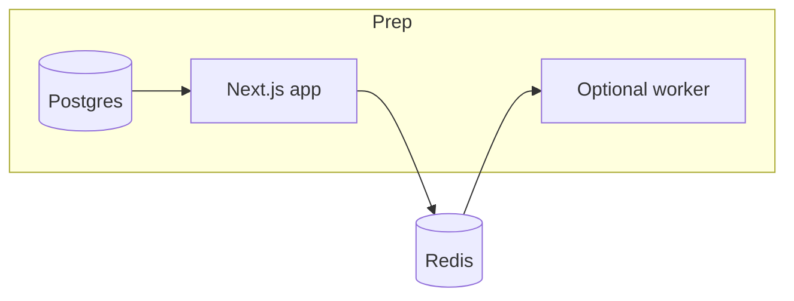

# Handshake Local — UAT test plans

Use these as runnable scripts during UAT. Record **Pass / Fail / Blocked**, notes, and screenshots for failures. Paths below are relative to your app origin (for example `http://localhost:3000`).

**Automated checks:** After [environment setup](#0-pre-uat-environment-checklist), run `npm run playwright:install` once (Chromium under `.playwright-browsers/`), then `npm run uat:env` and, with the dev server up, `npm run uat:e2e` (see [README.md](../README.md)).

---

## 0. Pre-UAT environment checklist

Before any scenario:

1. **Stack:** Node 20+, PostgreSQL 14+, schema applied (`npx drizzle-kit push`), seed run (`npm run db:seed`) per [README.md](../README.md).
2. **Env:** `.env` / `.env.local` has at least `DATABASE_URL`, `SESSION_SECRET` (32+ chars recommended), `CSRF_SECRET` (16+ chars), `APP_URL` matching how you open the app (see [src/lib/env.ts](../src/lib/env.ts)).
3. **Optional but recommended for email UAT:** `REDIS_URL` + `npm run worker` running; `RESEND_API_KEY` and `EMAIL_FROM` if you want real delivery (otherwise expect console/log behavior).
4. **Optional for image UAT:** S3-compatible vars from `.env.example` if profile uploads matter.
5. **Admin UAT:** `ADMIN_EMAILS` includes a dedicated test email you will sign up with (admins are assigned on sign-up per README).
6. **Browsers:** Use at least one clean profile or incognito for “customer” vs “provider” to avoid session confusion.

---

## Test plan 1 — Provider: account, onboarding, catalog

**Goal:** New provider can go from zero to a bookable public profile.

| Step | Action | Expected |
| ---- | ------ | -------- |
| 1.1 | Open `/signup`, register with a **non-admin** email and password | Account created; you reach authenticated area (dashboard or onboarding). |
| 1.2 | If prompted, complete `/dashboard/onboarding` (username, display name) | Username is accepted; reserved slugs fail with a clear message ([reserved usernames](../src/lib/reserved-usernames.ts)). |
| 1.3 | Open `/dashboard/profile` | Profile fields load; save changes persist after refresh. |
| 1.4 | If images are in scope, upload/attach profile image (depends on S3 config) | Image appears or documented skip if env missing. |
| 1.5 | Open `/dashboard/services` | Create at least one service (name, duration, price as applicable). |
| 1.6 | Open `/dashboard/availability` | Set availability so at least one future slot exists for the service. |
| 1.7 | Ensure profile is public/discoverable per UI (toggles on profile page) | Setting saves. |
| 1.8 | Open `/{yourUsername}` (public profile) in a **second** browser/session | Profile and services visible; links to booking work. |

---

## Test plan 2 — Customer: marketplace and public booking

**Goal:** Anonymous or logged-out user can find a provider and complete a booking.

| Step | Action | Expected |
| ---- | ------ | -------- |
| 2.1 | Open `/marketplace` | List or search UI loads; your test provider appears if discoverable. |
| 2.2 | Use search/filters if present | Results update without errors (`/api/marketplace/search` behavior). |
| 2.3 | Navigate to `/{username}` | Correct provider; services listed. |
| 2.4 | Open `/{username}/book/{serviceId}` | Booking form and slot picker load. |
| 2.5 | Pick a valid future slot, fill required customer fields, submit | Success confirmation; no duplicate booking for same slot if you retry the same selection. |
| 2.6 | Try an invalid case (past slot, overlapping booking, or empty required fields) | Clear validation or error; no corrupt data. |

---

## Test plan 3 — Provider: bookings list, detail, offline payment

**Goal:** Provider sees the new booking and can update status and payment metadata (cash/e-transfer — **no card processing**).

| Step | Action | Expected |
| ---- | ------ | -------- |
| 3.1 | As provider, open `/dashboard/bookings` | New booking appears with correct service/time/customer info. |
| 3.2 | Open `/dashboard/bookings/[id]` for that booking | Detail page matches list row. |
| 3.3 | Change booking status (e.g. confirmed / completed / cancelled — use labels your UI shows) | Persists after refresh. |
| 3.4 | Set payment method / paid flag / amount / notes per UI | Saves and displays correctly (manual offline tracking). |
| 3.5 | If notifications are enabled, confirm provider/customer receives expected email (or job processed in worker logs) | Document actual vs expected. |

---

## Test plan 4 — Customers (CRM) and marketing

**Goal:** Provider can use CRM and send templated communication where the product allows.

| Step | Action | Expected |
| ---- | ------ | -------- |
| 4.1 | Open `/dashboard/customers` | Customers from bookings appear or list is consistent with data model. |
| 4.2 | Open `/dashboard/customers/[id]` for one customer | Detail loads; edits (if any) persist. |
| 4.3 | Open `/dashboard/marketing` | Templates or send UI loads (seed may have added defaults per `db:seed`). |
| 4.4 | Execute a “send” or preview flow per UI | No server error; email or log behavior matches configuration. |

---

## Test plan 5 — Analytics

| Step | Action | Expected |
| ---- | ------ | -------- |
| 5.1 | Open `/dashboard/analytics` | Charts/tables load without error. |
| 5.2 | After creating additional bookings, refresh analytics | Numbers move in a sensible direction (or document if delayed/cached). |

---

## Test plan 6 — Authentication and account recovery

| Step | Action | Expected |
| ---- | ------ | -------- |
| 6.1 | Sign out; open `/login`; sign in with correct credentials | Session restored; dashboard accessible. |
| 6.2 | Wrong password | Safe error; no leak of whether email exists (best-effort check). |
| 6.3 | `/forgot-password` → request reset for known account | Email or log indicates reset path (depends on Resend). |
| 6.4 | Complete reset via `/reset-password` with token from email/log | New password works; old password does not. |
| 6.5 | `/verify-email` flow if signup requires verification | Verified state reflected; blocked actions cleared. |

---

## Test plan 7 — Admin (separate user)

**Prerequisite:** User registered whose email is listed in `ADMIN_EMAILS` (admin role on sign-up; typically **no** provider tenant per README).

| Step | Action | Expected |
| ---- | ------ | -------- |
| 7.1 | Sign up or sign in as admin email | Can access `/admin`. |
| 7.2 | Open `/admin/audit` | Audit UI loads; recent sensitive actions visible if any were performed. |
| 7.3 | Open `/admin/ai` | Page loads; behavior matches `FEATURE_AI_GATEWAY` / stub ([src/lib/ai-gateway.ts](../src/lib/ai-gateway.ts)) — may be logging-only. |
| 7.4 | Confirm non-admin user cannot access `/admin` | Redirect or 403 as implemented. |

---

## Test plan 8 — Security / regression smoke (short)

| Step | Action | Expected |
| ---- | ------ | -------- |
| 8.1 | From provider session, attempt to guess another provider’s dashboard URL or IDs | No cross-tenant data leakage. |
| 8.2 | Submit forms without CSRF token (e.g. tampered hidden field) if you can | Request rejected or safe failure. |
| 8.3 | Hit marketing site `/` | Loads; primary CTAs go to login/signup. |

---

## Defect log template (per finding)

- **ID:** UAT-001
- **Plan / step:** e.g. Plan 2, step 2.5
- **Severity:** Blocker / Major / Minor
- **Steps to reproduce:**
- **Expected vs actual:**
- **Environment:** browser, `APP_URL`, worker on/off, Resend on/off

---

## What this intentionally does not cover

- **Automated e2e:** Beyond `npm run uat:e2e`, UAT remains manual; extend Playwright specs in `e2e/` if needed.
- **Online card payments:** Not in product; only offline payment fields on bookings.
- **MFA:** Schema may mention flags; verify separately if you ship MFA.
